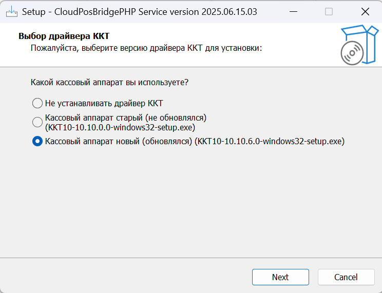

# Инструкция по установке сервиса печати чеков

Эта инструкция предназначена для пользователей без специальной технической подготовки. Пожалуйста, следуйте шагам внимательно.

## 1. Запуск установочного файла

1.  Найдите установочный файл сервиса. Его можно найти [по ссылке](https://github.com/AlexanderYekat/service_print_check/releases/). Обычно он называется `CloudPosBridgePHP_Setup.exe` или похожим образом.
2.  Скачайте его и дважды щелкните по нему, чтобы запустить установку.

## 2. Процесс установки

1.  **Приветствие:** Вы увидите окно приветствия установщика. Нажмите кнопку **"Далее"**.
2.  **Выбор кассы:** На этом этапе вам будет предложено выбрать тип кассы (старая или новая). **См. скриншот:**  Если вы не уверены, какой тип кассы у вас, обратитесь к специалисту или выберите вариант по умолчанию, который предложит установщик. После выбора нажмите **"Далее"**.
3.  **Выбор папки установки:** Рекомендуется оставить путь установки по умолчанию. Нажмите **"Далее"**.
4.  **Готовность к установке:** Убедитесь, что все настройки верны, и нажмите **"Установить"**.
5.  **Завершение установки:** Дождитесь завершения процесса установки. Это может занять несколько минут. После завершения установки нажмите **"Готово"** или **"Завершить"**.

## 3. Ярлык на рабочем столе

После установки на вашем рабочем столе появится новый ярлык. Он может называться "Настройки сервиса печати чеков" или "Диагностика ККТ" или что-то похожее.

**Что делает этот ярлык?**

Этот ярлык предназначен для:
*   **Настройки оборудования:** Если вам нужно подключить весы или какие-то особенные настройки связи для ККТ. По-умолчанию ККТ должна работать.
*   **Диагностики:** Если сервис печати чеков работает некорректно, вы можете использовать этот ярлык для проверки соединения с оборудованием и получения информации о состоянии сервиса.
*   **Изменения настроек:** Если вам потребуется изменить порт подключения или другие параметры сервиса.

## 4. Что делать, если что-то не работает?

Если после установки сервис не работает или вы столкнулись с ошибками:

1.  **Перезагрузите компьютер:** Иногда это помогает решить временные проблемы.
2.  **Запустите ярлык настроек/диагностики:** Используйте ярлык на рабочем столе для проверки состояния сервиса и оборудования. Возможно, вам потребуется изменить настройки или провести диагностику.
3.  **Проверьте подключение оборудования:** Убедитесь, что все кабели надежно подключены к компьютеру и оборудованию (ККТ, весы и т.д.).
4.  **Обратитесь к специалисту:** Если вы не можете решить проблему самостоятельно, соберите информацию о возникшей ошибке (например, текст ошибки из окна диагностики) и свяжитесь со службой поддержки или квалифицированным специалистом.

Надеемся, эта инструкция поможет вам успешно установить и использовать сервис! 